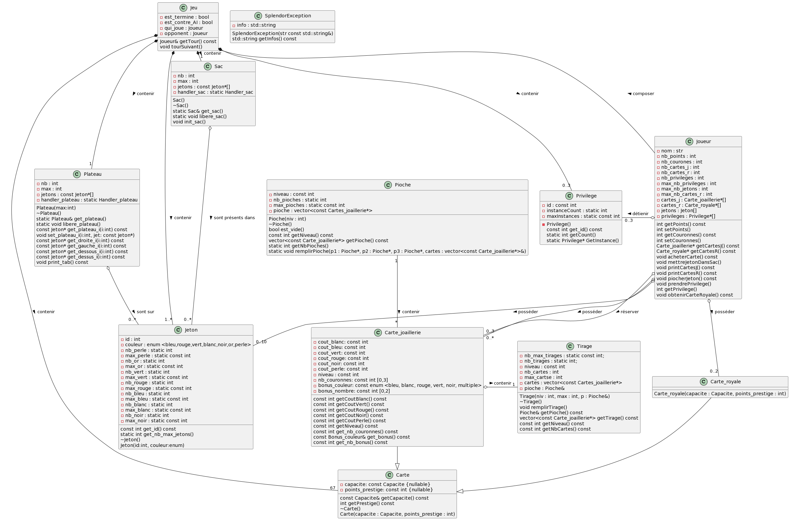

### **Rapport 2**

## LO21: Projet Splendor duel

## **Rapport 2:**
Petri Gaspard (co-reponsable), Leopold Chappuis, Fouinat Quentin (co-reponsable), Ghitu Alexandru, Vert Aubin

## Avancement des tâches à grande prioritées :

- Définition des classes, méthodes et fonctions à implémenter (5 membres) 
    - avancement 80% : la plupart des classes sont implementées. Il manque encore à implémenter en totalité :  Joueur et Jeu, car ces classes sont dépendentes de la majorité des autres classes, ce qui rend leur développement plus complexe. (temps consacré : environ 75 heures)
- répartition du développement des classes : 
  - Cartes, Exception : Léopold (12 heures de travail) 
  - Jetons, Plateau, Sac : Aubin (17 heures de travail)
  - Jeu, Joueur : Alexandru (15 heures de travail)
  - Privilège, Pioche : Gaspard (10-11 heures de travail)
  - Tirage : Quentin (8 heures de travail)

- interactions entre les classes : il faut qu'on finisse complètement toutes les classes pour avoir des interactions satisfaisantes. 

- Reflexions sur l'UML depuis le début (5 membres) : (4-5 heures de travail)

- Modification du diagramme UML : Quentin (2 heures de travail)
    - avancement 99%

- Création du JSON contenant toutes les cartes : Aubin (2h30 de travail)

- Scan des cartes du jeu pour l'interface graphique : Aubin (2-3 heures de travail)

  
## Nouvelles tâches & tâches mises à jour : 

### Priorité élevée

- développement du main
    - Durée estimée : 4/5 heures

- terminer le développement des classes/méthodes (et toutes les interactions)
    - Durée estimée :  15 heures

- développement de l’IA au hasard (permettant de tester les fonctions) 
    - Durée estimée :  5 heures 

- sauvegarde de la partie en cours (pouvoir reprendre la partie & conserver l'historique des scores)
    - Durée estimée : 10 heures 

### Priorité moyenne 

- Interface graphique (QT) pour tout le Jeu
    - Durée estimée : 30-35 heures

### Bonus s'il nous reste du temps 

- Une meilleure interface graphique
    - Durée estimée :  20 heures

- Une meilleure IA 
    - Durée estimée : 15-20 heures

- Mobilité des règles (ajustement des règles d'une partie possible)
    - Durée estimée : 10 heures

## Architecture implémentée (associations et hierarchie entre les classes ) :

### Récapitualitf des classes :
    - Jeu
    - Joueur
    - Cartes
        - Cartes Joaillerie 
        - Cartes Royales 
    - Plateau
    - Jeton
    - Sac
    - Pioche 
    - Tirage
    - Privilège
    - Exception

### Hierarchie entre les classes :
    - Jeu
        - Joueur
            - Cartes
            - Privilège
            - Jeton
        - Plateau
            - Privilège
            - Pioche
                - Cartes
            - Tirage 
                - Cartes
            - Jeton
        - Sac 
            - Jeton

### Associations entre les classes : 

 
## Remarques :

Nous avons utilisé la librairie nlohmann JSON for Modern C++
pour pouvoir lire simplement les cartes depuis le JSON créé. https://github.com/nlohmann/json 

Les temps de travail décrits dans ce rapport correspondent au temps passé par le membre en charge de la tâche. Or comme nous nous aidons les uns les autres régulièrement, cela ne représente pas le temps exact passé par chacun des membres sur le projet, il s'agit donc plutôt d'une borne inférieure.

## Bilan sur la cohesion du groupe :
Tout le monde s'entend toujours bien, nous travaillons ensembles. Le fait d'utiliser git est vraiment pertinent car on peut tous travailler sur nos branches respectives les tâches que l'on s'est réparties. Nous utilisons aussi un serveur discord avec plusieurs channels pour pouvoir travailler ensemble même à distance et éclaircir rapidement les zones d'ombres. 
- investissement : 
    - Aubin  ~ 8h semaine
    - Alexandru ~ 8h semaine
    - Gaspard ~ 6h semaine
    - Léopold ~ 6h semaine
    - Quentin ~ 6h semaine

