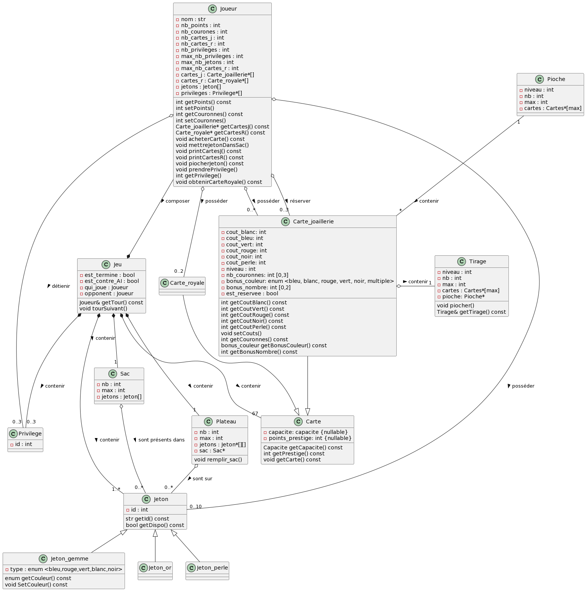

# LO21: Projet Splendor duel

# Rapport 1: 
Petri Gaspard, Leopold Chappuis, Fouinat Quentin, Ghitu Alexandru, Vert Aubin (responsable)

## Introduction du projet
Dans le cadre de notre cours de LO21, nous sommes missionnés pour créer une version numérique 
du jeu Splendor Duel, créé par Marc André et Bruno Cathala, et édité par Space Cowboy.
Pour cela, nous devons utiliser le langage C++ et employer une approche orientée objet.

Pour mener à bien ce projet, nous devrons mobiliser les différentes connaissances acquises en cours.
De plus, un tel projet nous permettra d'apprendre à gérer un projet du début 
jusqu'à la fin et ce en travaillant en équipe.
Ainsi, au cours de cette expérience, nous devrons faire preuve d'esprit d'équipe,
de rigueur, d'anticipation, d'adaptabilité et de polyvalence face aux différentes tâches que nous 
devrons traiter.

Dans ce premier rapport, vous trouverez une analyse des concepts, la liste des premieres tâches effectuées 
ainsi que la liste des futures tâches que nous avons identifiées.

# Liste des tâches déjà réalisées et leur répartition
 - Diagrame UML: Gaspard, Leopold, Aubin
 - Analyse des concepts: Quentin, Alexandru

# Liste des tâches à venir avec répartition
Cette liste est vouée à être modifiée et remplie au fur et à mesure de l'avancement de notre réalisation. 
En effet, de nombreux problèmes et tâches viendront probablement remplir cette liste davantage.
Également, en fonction de notre avancée, certaines tâches pourront changer de nature de priorité. 

### Tâches de grandes priorités
- étude des design patterns conseillés (tous le monde)
- définition des classes (les 5 membres ensemble)
- définition des méthodes (répartition en fonction de la création des classes)
- interaction entre les classes (ex: stockage des jetons par un joueur, ou un sac)
- réflexion sur les fonctions à implémenter

### Tâches de priorité moyenne
- développement de l'IA au hasard (permettant de tester les fonctions)
- MLD sur l'UML pour sauvegarde de la partie en cours
- réfléchir à notre façon de "stocker" une partie en cours (XML,SQLITE,JSON,...)

### Tâches de faible priorité
-  Se former pour interface graphique 

### Tâches de priorité bonus
- faire une IA un peu plus recherchée qu'avec du hasard
- ajuster le nombre d'emplacements/jetons pour règle supplémentaire

# Analyse des concepts

## But du jeu 

Splendor Duel est un jeu pour 2 joueurs basé sur Splendor, qui a été fait pour plusieurs personnes. Il a été créé par Marc André et Bruno Cathala, et édité par SPACE Cowboys.
En tant que maître de bijoux destinés aux monarques et autres dirigeants puissants de la Renaissance, le joueur affronte son rival en collectionnant des cartes.

## Conditions pour la victoire 

Afin de gagner le jeu, un joueur doit remplir l’une des conditions suivantes :

- Posséder **20 points de Prestige ou plus**.
- Posséder **10 couronnes ou plus**.
- Posséder **10 points de Prestige ou plus sur des cartes de la même couleur**.

## Différents objets du jeu 

### Jetons 

Il y a **25 jetons**. Il y en a
- 4 de chacune des cinq couleurs des **gemmes** (bleu, blanc, vert, noir et rouge).
- 2 **perles**
- 3 **or**.

A la fin de chaque tour, le joueur peut posséder **au plus 10 jetons**. S’il dépasse cette limite, il doit remettre dans le sac les jetons de son choix afin d’en avoir 10.
Au début du jeu, les 25 jetons nécessaires pour remplir le plateau sont placés aléatoirement en suivant la spirale dessinée.

**Les jetons Or sont des jokers** et peuvent être utilisés à la place de n'importe quel jeton Gemme ou Perle. Ils sont pris au moment de la réservation d’une carte. Une carte ne peut pas être réservée si le joueur en a déjà réservé 3 ou s’il n’y a plus de jetons Or sur le plateau.

**Attributs** :

- **id**.
- **couleur** (pour les jetons).

**Méthodes** : 

- str getId() const
- bool getDispo() const (indique si le jeton est disponible sur le plateau ou pas).

**Remarques** :

- Les jetons seront implémentés sous forme d'héritage pour les gemmes, or et perle (voir UML).
- Si le joueur prend 3 jetons de la même couleur ou 2 jetons perles lors d'un tour, son adversaire gagne 1 privilège.

## Cartes 

Les 2 classes (Carte_joaillerie et Carte_royale) vont partager des attributs et méthodes de la classe Carte. (voir UML).
On parle d'héritage (pas encore vu en cours).

**Attributs** : 
- **capacite**.
- **points_prestige**.

**Méthodes** : 

- Carte getCarte()
- Capacite getCapacite() const
- int getPrestige() const

### Cartes joaillerie 

Il y a **3 types de cartes** séparées par niveau, qui devront être mélangées à part, avant chaque jeu. Au total il y a 67 cartes.

**Attributs** :

- **cout_blanc**.
- **cout_bleu**.
- **cout_vert**.
- **cout_rouge**.
- **cout_noir**.
- **cout_perle**.
- **niveau**.
- **nb_couronnes**.
- **bonus_couleur** qui diminue le coût des futurs achats de cartes.
- **bonus_nombre**.
- **est_reservee** (est réservée ou pas).

**Méthodes** : 

- int getCoutBlanc() const
- int getCoutVert() const
- int getCoutRouge() const
- int getCoutNoir() const
- int getCoutPerle() const
- void setCouts()
- int getCouronnes() const
- bonus_couleur getBonusCouleur() const
- int getBonusNombre() const

**Remarques** :

- Il est possible d’avoir suffisamment de bonus pour réduire le coût d’une carte à 0 jeton. Si le joueur possède un bonus supérieur au coût de la carte, il ne gagne pas de jetons.

### Cartes Royales #

Il y a **4 cartes royales**. Elles peuvent être prises à l’obtention de la 3e couronne ou de la 6e. Prendre une carte Royale n’est pas une action. Les joueurs placent leurs cartes Royales à côté de leurs cartes Joaillerie.

**Attributs**

- Pas d'attributs propres, elles sont partagées avec la classe Carte.

**Méthodes**

- Pas de méthodes propres, elles sont partagées avec la classe Carte.

## Privilèges 

Il y a **3 Privilèges** au total dans le jeu. Les Privilèges permettent l’action Privilège. Celle-ci permet au joueur de prendre sur le plateau 1 jeton Gemme ou Perle de son choix par Privilège dépensé. Il est interdit de prendre un jeton Or dans ce cas.

Ils peuvent être obtenus dans les cas suivant :
- Si l’adversaire du joueur remplit le plateau.
- Si 3 jetons de la même couleur ou 2 jetons Perle sont pris par son adversaire.
- Capacité privilège qui permet au joueur d’en prendre 1.

**Important** : pendant la partie, lorsqu’un joueur est censé prendre un Privilège et que plus aucun n’est disponible au-dessus du plateau, il le prend à son adversaire. S’il possède déjà les trois, rien ne se passe.

**Attributs** :

- **id**.

**Méthodes** :

- Pas de méthodes.

## Plateau 

Le plateau permettra de connaître son état, c’est-à-dire les jetons et leur emplacement

**Attributs** :

- **nb** (nombre de jetons sur le plateau).
- **max** (nombre maximal qu'il peut y avoir sur le plateau: utile si on le modifiera pour une future mise à jour d'extension du jeu par exemple).
- **Jetons** (matrice avec les positions des jetons).

**Méthodes** :

- Pas de méthodes.

## Sac de jetons 

Ce sac contient les jetons utilisés par les joueurs lors de l'achat de cartes joaillerie.
Cette classe nous permet de connaître les jetons qui y sont (bien qu'ils sont privé pour l'utilisateur, cf: encapsulation).

- **nb** (nombre de jetons dans le sac).
- **max** (nombre maximal qu'il peut y avoir dans le sac: utile si on le modifiera pour une future mise à jour d'extension du jeu par exemple).
- **Jetons** (tableau avec les jetons qui y sont).

## Jeu

**Attributs** :

- **est_termine**
- **est_contre_AI**
- **qui_joue** (va pointer sur le joueur qui joue cette partie)
- **opponent** (va pointer sur le joueur qui ne joue pas cette partie)

**Méthodes** :

- Joueur& getTour() const (savoir à qui est le tour)
- tourSuivant() (donne naissance au tour suivant)

## Joueur

**Attributs** :

- **nom**.
- **nb_points**.
- **nb_couronnes**.
- **nb_cartes_j**.
- **nb_cartes_r**.
- **max_nb_jetons**.
- **max_nb_cartes_r**.
- **cartes_j** (tableau de cartes joaillerie).
- **cartes_r** (tableau de cartes royales).
- **jetons**.
- **privileges**.

**Méthodes** :

- int getPoints() const
- int setPoints()
- int getCouronnes() const
- int setCouronnes()
- Carte* getCartesJ() const
- Carte* getCartesR() const
- void acheterCarte()
- void mettreJetonDansSac()
- void printCartesJ() const
- void printCartesR() const
- void piocherJeton()
- void prendrePrivilege()
- int getPrivilege()
- void obtenirCarteRoyale()

Remarque: voir au moment de l'implémentation d'héritage le type retourné par getCartesJ() et getCartesR

## Pioche

**Attributs** (partagés par les 3 pioches):

- **niveau**.
- **nb**. (nb de cartes dans la pioche)
- **max**. (nb max de cartes dans la pioche)
- **cartes**. (tableau de cartes dans la pioche)

**Méthodes** :

- Pas de méthodes.

## Tirage

**Attributs** (partagés par les 3 tirages):

- **niveau**.
- **nb**. (nb de cartes dans le tirage)
- **max**. (nb max de cartes dans le tirage)
- **cartes**. (tableau de cartes dans le tirage)

Nous allons faire 3 classes de tirage, chacun contiendra la pioche dans lequel le tirage prend les cartes (qui correspondra à son niveau donc). L'attribut spécifique de chaque classe sera : 

- **pioche**

**Méthodes** :

- void piocher()
- Tirage& getTirage() const

## Actions

### Facultatives

Au début de son tour, le joueur effectue **0, 1 ou 2 actions optionnelles dans l’ordre indiqué** puis 1 et 1 seule action obligatoire.
1.	Utiliser un **privilège**
2.	**Reconstituer le plateau**

### Obligatoires

**Cas particulier** : si vous ne pouvez pas effectuer d’action obligatoire, vous devez effectuer l’action optionnelle « Remplir le plateau de jeu » avant de choisir votre action obligatoire.

Le joueur doit effectuer **une et une seule** des trois actions suivantes :
- **Prendre jusqu’à 3 jetons**
  Le joueur prend jusqu’à 3 jetons Gemme et/ou Perle sur le plateau. Ceux-ci doivent être adjacents les uns aux autres en ligne, en colonne ou en diagonale. De plus, il ne doit y avoir ni case vide ni jeton Or entre les jetons pris. Il est permis de ne prendre que 2 jetons adjacents, ou même 1 seul. Il est interdit de prendre un jeton Or avec cette action.
- Prendre **1 jeton Or pour réserver 1 carte Joaillerie**.
- Acheter **1 carte Joaillerie**.

# UML

Il faut noter que les héritages représentés dans cet UML sont implicitement considérés comme exclusifs. 

# Affinité dans le groupe
Tous le monde s'entend bien. Nous travaillons généralement tous ensemble afin de nous mettre d'accord sur nos façons de procéder.
En effet, nous pensons que le fait de nous regrouper à 5 nous permet de faire des choix réfléchis et nous permet de nous mettre d'accord rapidement sur d'éventuels points de désaccord.
